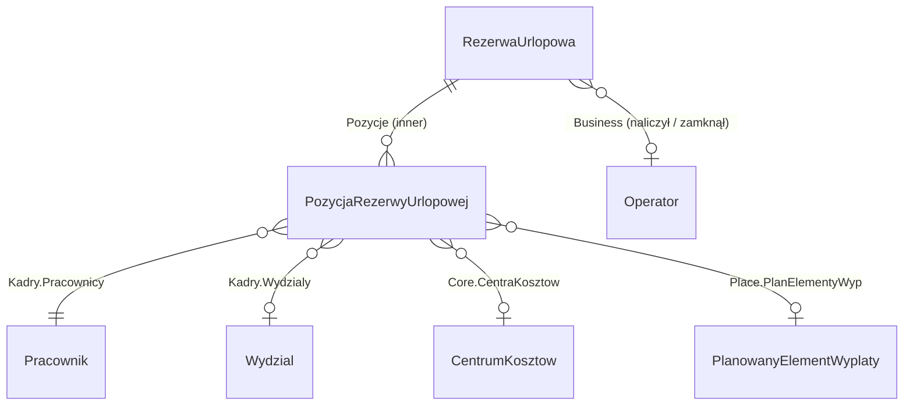

# Dodatek „Rezerwy urlopowe” (A1.RezerwyUrlopowe) — Etap 3: Specyfikacja szczegółowa

Status: **projekt do akceptacji** · wersja 0.1 · 2026-10-09
Podstawa: Etap 1 i 2 (zaakceptowane), zgoda na DLL (kwestia 3), rozwiązanie skryptowe `Rezerwy urlopowe/`
jako wzorzec obliczeń (algorytm, 30 scenariuszy RU-01…RU-30), inwentaryzacja enova 2512.5.6.

Projekty: `A1.RezerwyUrlopowe` (dane, logika, konfiguracja), `A1.RezerwyUrlopowe.UI` (formularze, listy,
strona Opcji), `A1.RezerwyUrlopowe.Tests` (testy integracyjne). Przestrzeń nazw `A1.RezerwyUrlopowe`.

## 3.1. Dane operacyjne

### Mapowanie nazw

| Nazwa logiczna | RowType | `tablename` (≤16) |
|---|---|---|
| Rezerwa urlopowa (nagłówek miesiąca) | `RezerwaUrlopowa` | `RezerwyUrlopowe` |
| Pozycja rezerwy urlopowej | `PozycjaRezerwyUrlopowej` | `PozRezerwUrlop` |

Nazwy sprawdzone z inwentaryzacją i bazą — brak kolizji. Konfiguracja dodatku nie ma tabel: węzeł `CfgNodes`
„Kadry i płace / Rezerwy urlopowe” (wzorzec standardowej konfiguracji enova).

### RezerwaUrlopowa (`RezerwyUrlopowe`) — dokument operacyjny, `Guided = root`

| Pole | Typ | Uwagi |
|---|---|---|
| Rodzaj | enum `RodzajRezerwyUrlopowej` { Rezerwa, Budzet } | wymagane |
| Okres | `YearMonth` | miesiąc rezerwy (budżet: miesiąc naliczenia, zwykle sierpień) |
| Stan | enum `StanRezerwyUrlopowej` { Naliczona, Zamknieta } | domyślnie Naliczona |
| DataNaliczenia | `DateTime` | ostatnie naliczenie |
| NaliczylOperator | lookup `Business.Operator` | |
| DataZamkniecia, ZamknalOperator | `DateTime`, lookup `Operator` | puste dla Naliczona |
| Parametry | subrow `ParametryNaliczenia` (kopia konfiguracji z chwili naliczenia) | tylko odczyt — audyt |
| ― WariantPodstawy | enum { Podstawa1, Podstawa2, Wyzsza } | |
| ― ZasadniczeNominalne, PomijajMiesiaceBezWyplaty, ZaokraglajKolejnyUrlop, DopuszczajUjemna, PpkWNarzutach, BudzetZPelnymLimitem | `bool` | |
| ― MiesiecyPodstawy | `int` (1–12) | |
| ― WspolczynnikEkwiwalentu | `decimal` | z konfiguracji enova na koniec miesiąca |
| LiczbaPozycji, GodzinyRazem | `int`, `decimal` | sumy denormalizowane (aktualizuje czynność) |
| KwotaRazem, NarzutyRazem | `Currency` | |
| Opis | `string(200)` | |

Klucz unikalny: (Rodzaj, Okres). Indeks: (Okres, Rodzaj) dla listy. Bez numeracji dokumentów (identyfikacja
przez Rodzaj + Okres, np. „Rezerwa 2026/10”).

### PozycjaRezerwyUrlopowej (`PozRezerwUrlop`) — `child: Rezerwa → RezerwaUrlopowa`

| Pole | Typ | Uwagi |
|---|---|---|
| Rezerwa | lookup inner `RezerwaUrlopowa` | |
| Pracownik | lookup `Kadry.Pracownik` | wymagane |
| Wydzial | lookup `Kadry.Wydzial` | migawka na koniec miesiąca |
| CentrumKosztow | lookup `Core.CentrumKosztow` | MPK z wydziału lub najbliższego nadrzędnego |
| WymiarEtatu | `Fraction` | |
| GodzinNaDzien | `decimal` | godziny dnia urlopu × wymiar (przeliczanie h ↔ dni) |
| ZaleglyGodz, BiezacyGodz, WykorzystanyGodz, GodzinyRezerwy | `decimal` (h, 2 miejsca) | budżet: Biezacy = limit roku następnego, Wykorzystany = 0 |
| ZaleglyDni, BiezacyDni, WykorzystanyDni, DniRezerwy | wyliczane (h / GodzinNaDzien) | nie przechowywane |
| Podstawa1, Podstawa2 | `Currency` | miesięcznie |
| MiesiecyPodstawy1 | `int` | ile miesięcy weszło do średniej |
| StawkaGodzinowa | `decimal` (4 miejsca) | wg wariantu |
| Kwota | `Currency` | GodzinyRezerwy × StawkaGodzinowa |
| Narzuty | `Currency` | z planowanego elementu wypłaty (silnik płac) |
| KwotaPoprzednia, Zmiana | wyliczane | kwota pozycji tego pracownika w poprzednim miesiącu (ten sam rodzaj); Zmiana = Kwota − KwotaPoprzednia |
| PlanowanyElement | lookup `Place.PlanowanyElementWypłaty` (opcjonalne) | powiązanie z księgowaniem |
| Ostrzezenia | `string(200)` | np. „brak wypłaty za 2026/10” |
| ZapisObliczen | `MemoText` | log sekcji [1]–[5] (jak w rozwiązaniu skryptowym) |

Klucz unikalny: (Rezerwa, Pracownik). Indeks: (Pracownik) — historia pracownika i porównanie m/m.
Pozycje tylko do odczytu w GUI (tworzy/aktualizuje je czynność naliczenia).

### Konfiguracja (`CfgNodes`, Narzędzia → Opcje → Kadry i płace → Rezerwy urlopowe)

| Węzeł / parametr | Typ | Domyślnie |
|---|---|---|
| Podstawa / WariantPodstawy | enum | Podstawa1 |
| Podstawa / ZasadniczeNominalne | bool | Tak |
| Podstawa / MiesiecyPodstawy | int | 3 |
| Podstawa / PomijajMiesiaceBezWyplaty | bool | Tak |
| Urlop / DefinicjeLimitow | lista GUID `DefinicjaLimitu` | wypoczynkowy, dodatkowy |
| Urlop / ZaokraglajKolejnyUrlop | bool | Tak |
| Urlop / DopuszczajUjemna | bool | Nie |
| Narzuty / PpkWNarzutach | bool | Nie |
| Budżet / BudzetZPelnymLimitem | bool | Tak |
| Powiązania / ElementRezerwy, ElementBudzetu | GUID `DefinicjaElementu` | z danych inicjujących |
| Powiązania / PlanowanaListaRezerwy, PlanowanaListaBudzetu | GUID `DefinicjaPlanowanejListyPłac` | z danych inicjujących |
| Kontrole / NiezatwierdzoneListyPlac | enum { Blokada, Ostrzezenie } | Blokada |

## 3.2. Diagram relacji

## 3.3. Relacje do danych platformy

| Moduł | TableType / RowType | Typ relacji | Cel |
|---|---|---|---|
| Kadry | `Pracownicy` / `Pracownik` | lookup (pozycja) | pracownik pozycji, `PracHistoria` (etat, wymiar, wydział, zaszeregowanie) |
| Kadry | `Wydzialy` / `Wydzial` | lookup (pozycja) | migawka wydziału, nadrzędny dla MPK |
| Core | `CentraKosztow` / `CentrumKosztow` | lookup (pozycja) | MPK |
| Business | `Operatorzy` / `Operator` | lookup (nagłówek) | audyt naliczenia i zamknięcia |
| Kalend | `LimNieobecnosci` / `LimitNieobecnosci`, `DefinicjeLimitow` / `DefinicjaLimitu` | logiczne (odczyt) | zaległy (`PrzeniesienieGodz`), należny (`LimitGodz`, `ZmianaGodz`, `WykorzystanyPoprzGodz`), znacznik `PierwszyUrlop` |
| Kalend | `Nieobecnosci` / `Nieobecnosc` (przez `KalkulatorPracownika.Nieobecnosci`) | logiczne | wykorzystany urlop |
| Place | `WypElementy` / `WypElement` | logiczne (odczyt) | składniki podstawy 1 (`Nieobecnosci.Ekwiwalent.Typ`) |
| Place | `DefElementow` / `DefinicjaElementu` | konfiguracja | elementy rezerwy / budżetu (algorytm = klasa dodatku) |
| Place | `DefPlanListPlac`, `PlanListyPlac`, `PlanowaneWyplaty`, `PlanElementyWyp` | lookup + wywołanie | naliczenie narzutów i księgowanie |
| Place | konfiguracja `Nieobecności.ŚredniaNormaMiesięczna`, `EkwiwalentZaUrlop`, `RezerwyUrlopowe.Ogólne` | odczyt | współczynnik, norma dnia, warunek dostępności planu |

Rozszerzenia istniejących tabel: brak.

## 3.4. Podstawowe listy modułu

**Lista „Rezerwy urlopowe”** (folder `Kadry i płace/Płace/Rezerwy urlopowe`, tabela `RezerwyUrlopowe`)
- Kolumny: Rodzaj, Okres, Stan, Liczba pozycji, Godziny, Kwota, Narzuty, Razem (kwota + narzuty), Zmiana m/m,
  Data naliczenia, Naliczył. Opcjonalne: Data zamknięcia, Zamknął, Współczynnik, Wariant podstawy.
- Filtry: Rodzaj (Wszystkie / Rezerwa / Budżet), Rok, Stan.
- Filtry predefiniowane: „Rok bieżący”, „Niezamknięte”.

**Lista pozycji** (zakładka formularza rezerwy i folder `…/Rezerwy urlopowe/Pozycje` do analiz wielomiesięcznych)
- Kolumny: Kod, Imię, Nazwisko, Wydział, MPK, Urlop zaległy / bieżący / wykorzystany (dni), Dni rezerwy,
  Godziny, Podstawa 1, Podstawa 2, Stawka 1 h, Kwota, Narzuty, Razem, Kwota poprzednia, Zmiana, Ostrzeżenia.
  Opcjonalne: Wymiar etatu, Liczba miesięcy podstawy, godziny (zaległy/bieżący/wykorzystany).
- Filtry: MPK, Wydział, Pracownik, „Tylko z ostrzeżeniami”, (folder Pozycje) Okres od–do, Rodzaj.
- Grupowanie predefiniowane: MPK, Wydział.

**Zakładka „Rezerwy urlopowe” w kartotece pracownika** (opcjonalna) — pozycje pracownika, sortowanie wg okresu.

## 3.5. Formularze

**RezerwaUrlopowa**
- *Ogólne:* grupa „Rezerwa” (Rodzaj, Okres, Stan, Opis); grupa „Naliczenie” (Data naliczenia, Naliczył, Data zamknięcia,
  Zamknął); grupa „Sumy” (Liczba pozycji, Godziny, Kwota, Narzuty, Razem, Zmiana m/m).
- *Pozycje:* lista pozycji (3.4).
- *Podsumowanie wg MPK:* lista pogrupowana (MPK → liczba pracowników, godziny, kwota, narzuty, zmiana).
- *Parametry naliczenia:* subrow `Parametry` tylko do odczytu.
- *Planowane listy płac:* listy `PlanListyPlac` definicji powiązanej z rodzajem za ten okres (z przejściem do listy).

**PozycjaRezerwyUrlopowej** (tylko odczyt)
- *Ogólne:* Pracownik, Wydział, MPK, Wymiar etatu; „Urlop” (godz./dni: zaległy, bieżący, wykorzystany, rezerwa);
  „Podstawy” (Podstawa 1 + liczba miesięcy, Podstawa 2, współczynnik z nagłówka, stawka 1 h); „Wynik” (Kwota, Narzuty,
  Razem, Kwota poprzednia, Zmiana); Ostrzeżenia.
- *Zapis obliczeń:* MemoText.
- *Księgowanie:* planowany element wypłaty (link), planowana lista.

**Strona Opcji „Rezerwy urlopowe”** (`Config.RezerwyUrlopowe.pageform.xml` + extender): grupy Podstawa, Urlop,
Narzuty, Budżet, Powiązania, Kontrole — pola z 3.1 (konfiguracja).

## 3.6. Weryfikatory

| Obiekt | Reguła | Pola-źródła | Poziom | Komunikat |
|---|---|---|---|---|
| RezerwaUrlopowa | (Rodzaj, Okres) unikalne | Rodzaj, Okres | Error | „Rezerwa {rodzaj} za {okres} już istnieje.” |
| RezerwaUrlopowa | Okres budżetu = miesiąc budżetu (sierpień) — informacyjnie | Rodzaj, Okres | Warning | „Budżet liczony zwykle w sierpniu — sprawdź okres.” |
| RezerwaUrlopowa | Zamknięta → pozycje i pola tylko do odczytu | Stan | (IsReadOnly) | — |
| PozycjaRezerwyUrlopowej | (Rezerwa, Pracownik) unikalne | Pracownik | Error | „Pracownik ma już pozycję w tej rezerwie.” |
| PozycjaRezerwyUrlopowej | Kwota ≥ 0, chyba że DopuszczajUjemna | Kwota | Error | „Ujemna rezerwa niedozwolona w konfiguracji.” |
| Konfiguracja | Element rezerwy/budżetu: Rodzaj naliczania = Tylko planowane, Do wypłaty = Nie, algorytm = klasa dodatku | Powiązania | Error | „Element {nazwa} nie jest skonfigurowany jako element rezerwy.” |
| Konfiguracja | Definicja planowanej listy: Element = element rezerwy/budżetu, wzór numeracji niepusty | Powiązania | Error | „Definicja {symbol}: niepoprawny element lub brak numeracji.” |
| Konfiguracja | MiesiecyPodstawy 1–12 | MiesiecyPodstawy | Error | „Liczba miesięcy podstawy 1–12.” |

## 3.7. Workery i czynności

**W1. `NaliczRezerweUrlopowaWorker`** — czynność „Nalicz rezerwę urlopową” na liście Rezerwy urlopowe
i na liście Pracownicy (zaznaczeni). Parametry (`ContextBase`): Rodzaj, Okres, Zakres (zaznaczeni / zatrudnieni
na koniec miesiąca), NaliczPonownie (nadpisz istniejące pozycje). Uprawnienie: Płace.
1. Kontrole: licencja Płace Platynowe; ustawienie standardu „Rezerwy urlopowe do testów”; nagłówek nie Zamknięta;
   konfiguracja poprawna (3.6); współczynnik > 0; niezatwierdzone wypłaty etatowe za miesiąc → Blokada/Ostrzeżenie.
2. Nagłówek: znajdź lub utwórz (Rodzaj, Okres); zapisz kopię parametrów i współczynnik.
3. Dla każdego pracownika (sesja per pracownik, pasek postępu, błąd jednego nie przerywa całości):
   `KalkulatorRezerwyUrlopowej.Oblicz(pracownik, okres, rodzaj, parametry)` → pozycja (stan urlopu, podstawy, kwota,
   zapis obliczeń, ostrzeżenia).
4. Naliczenie planowanej listy płac definicji rodzaju dla tych pracowników (standardowy mechanizm
   `NaliczaniePlanowanychListPłac`); element rezerwy (klasa W4) bierze kwotę z pozycji → silnik liczy narzuty.
5. Przepisanie `Narzuty` i `PlanowanyElement` do pozycji; sumy w nagłówku; log z błędami.
Oczekiwany czas: 1 000 pracowników < 10 min.

**W2. `ZamknijRezerweWorker`** — czynność na rezerwie (Stan = Naliczona): Stan = Zamknięta, data, operator;
opcjonalnie zatwierdza powiązane planowane listy płac (kwestia 12). **W3. `OtworzRezerweWorker`** — Stan = Naliczona;
osobne prawo (kwestia 11).

**W4. `AlgorytmRezerwyUrlopowej : Soneta.Place.AlgorytmBase`** — klasa algorytmu elementów rezerwy i budżetu
(definicja elementu: Algorytm = Klasa algorytmu, Nazwa = `A1.RezerwyUrlopowe.AlgorytmRezerwyUrlopowej`).
- `Podstawa(Element, Składnik)`: gdy `!PlanowaneWynagrodzenie` → zero; szuka pozycji (pracownik, okres, rodzaj z definicji);
  gdy brak (plan naliczony ręcznie poza czynnością) → liczy kalkulatorem; ustawia Podstawa1–5, Czas, Ilość jak skrypt.
- `Wartosc(Element, Składnik)`: Czas × stawka.

**A1. `KalkulatorRezerwyUrlopowej`** (serwis, jedno źródło obliczeń, przeniesienie 1:1 z algorytmu skryptowego):
StanUrlopu (limity, pierwszy/kolejny urlop, zaokrąglenie, wykorzystanie), Wspolczynnik, Podstawa1 (jeden przebieg po
`WypElementy`, miesiące z wypłatą, niepełny miesiąc nominalnie), Podstawa2 (`NaliczanieEkwiwalent`, odczyt wewnątrz
`Logout`), Wynik; zapis obliczeń przez `Log("Rezerwa urlopowa")`.
**A2. `SymulatorLimituUrlopu`** — budżet: `NaliczanieLimitowUrlopowych.DodajLimit` w niezapisywanej sesji.
**A3. Pola wyliczane** — KwotaPoprzednia / Zmiana (pozycja tego pracownika w poprzednim okresie, ten sam rodzaj).

## 3.8. Algorytmy w transakcji serwerowej

Brak logiki wymagającej `ServerEvents`. Jedyna zależność międzystanowiskowa — dwa równoległe naliczenia tej samej
rezerwy oraz naliczenie równoległe z zamknięciem — zabezpieczona kluczem unikalnym (Rodzaj, Okres) i blokadą
optymistyczną nagłówka (worker ponownie sprawdza Stan przed zapisem). Brak numeracji ciągłej.

## 3.9. Raporty i wydruki

- **Zestawienie rezerwy wg MPK** (wydruk .repx, PDF/Excel): parametry Rodzaj, Okres; grupy MPK → pracownicy;
  sumy godzin, kwot, narzutów; kolumna zmiany m/m.
- **Raport zmian m/m** (zawiązanie / rozwiązanie rezerwy per MPK) — dla księgowości i Zarządu.
- **Eksport**: standardowy eksport list do Excela (lista pozycji).

## 3.10. Procesy Workflow

Stany: **Naliczona → Zamknięta** (W2), **Zamknięta → Naliczona** (W3, uprawnienie specjalne). Ponowne naliczenie
tylko w stanie Naliczona. Brak ścieżki akceptacji (decyzja Etapu 2). Automatyzacje: brak w v1 (zadanie cykliczne —
kierunek rozwoju).

## 3.11. Uprawnienia i role

| Funkcjonalność | Płace | Kadry | Zarząd / kontroling | Księgowość | Administrator |
|---|---|---|---|---|---|
| Lista Rezerwy urlopowe — odczyt | Tak | Tak | Tak | Tak | Tak |
| Nalicz rezerwę (W1) | Tak | Nie | Nie | Nie | Tak |
| Zamknij miesiąc (W2) | Tak | Nie | Nie | Nie | Tak |
| Otwórz miesiąc (W3) | Nie | Nie | Nie | Nie | Tak |
| Zapis obliczeń pozycji | Tak | Tak | Tak | Tak | Tak |
| Konfiguracja (Opcje) | Nie | Nie | Nie | Nie | Tak |

Drzewo uprawnień (`*.rightstree.xml`): gałąź **„Kadry i płace / Rezerwy urlopowe”** — `RezerwaUrlopowa`
(pozycje dziedziczą), osobny węzeł „Otwieranie zamkniętej rezerwy”; konfiguracja w gałęzi Opcji Kadr i płac.
Uprawnienia do danych: bez ograniczeń wierszowych (rezerwa ogólnofirmowa); opcjonalnie wg wydziałów — kierunek rozwoju.

## 3.12. Integracje szczegółowe

Brak integracji zewnętrznych (Etap 2). Księgowanie: standardowy schemat księgowy planowanych list płac (RUEW).

## 3.13. Scenariusze i testy integracyjne

| Element logiki | Scenariusz testu | Oczekiwany rezultat |
|---|---|---|
| A1 Kalkulator — stan urlopu | RU-01…RU-07 (zaokrąglenie, zaległy, 1/2 etatu, pierwszy urlop, ujemny, zwolniony, urlop dodatkowy) | zgodnie z arkuszem scenariuszy |
| A1 Kalkulator — podstawa 1 | RU-08…RU-14 | jw. |
| A1 Kalkulator — podstawa 2, wariant, współczynnik, narzuty | RU-15…RU-19 | jw.; podstawa 2 = `NaliczanieEkwiwalent` |
| A2 Symulator limitu | RU-22…RU-24 | limity roku następnego; brak zapisu limitów w bazie |
| W4 Algorytm elementu | element na planowanej liście = kwota pozycji; brak elementu na zwykłej liście (RU-20) | narzuty > 0, wypłata bez elementu |
| W1 Naliczenie | nagłówek + pozycje + planowane listy (RU-21: 2 wydziały), ponowne naliczenie nadpisuje, błąd jednego pracownika nie przerywa | sumy nagłówka = suma pozycji |
| W1 Kontrole | brak licencji / wyłączone „Rezerwy urlopowe do testów” / niezatwierdzona lista (RU-14) / współczynnik 0 (RU-18) / rezerwa zamknięta | blokada lub ostrzeżenie zgodnie z konfiguracją |
| W2 / W3 | zamknięcie blokuje naliczenie i edycję; otwarcie tylko z prawem | stan i uprawnienia |
| A3 Zmiana m/m | dwa kolejne miesiące, pracownik nowy / zwolniony | KwotaPoprzednia = 0 dla nowego; zmiana poprawna |
| Weryfikatory 3.6 | każdy: przypadek poprawny i błędny | Error blokuje, Warning przepuszcza |
| Wydajność | 1 000 pracowników, rezerwa i budżet | < 10 min; lista < 3 s |
| Zgodność ze skryptem | te same dane, parametry pilotażu | kwoty identyczne jak rozwiązanie skryptowe |

Testy na prawdziwej bazie (`TestBase`) z danymi z 3.15; scenariusze RU-xx jako testy parametryzowane.

## 3.14. Dane konfiguracyjne inicjujące bazę (dbinit)

| Zestaw | Obiekty | GUID (stałe, własne dodatku) | Kolejność | dbversion |
|---|---|---|---|---|
| Elementy | `DefinicjaElementu` „Rezerwa urlopowa (dodatek)”, „Budżet rezerwy urlopowej (dodatek)” (Klasa algorytmu, Tylko planowane, Do wypłaty = Nie, ZUS naliczać, PIT nie, Naliczanie = płatna z dołu, priorytet 200, zapis obliczeń „Rezerwa urlopowa”, etykiety Podstawa1–5/Czas) | 8e6a7f2c-c06f-4917-9d81-7bf6b1c9aa66, 8edae287-6afb-4890-abc0-791b83bbb58c | 1 | 1.0 |
| Planowane listy | `DefinicjaPlanowanejListyPłac` AREZURL „Rezerwa urlopowa (dodatek)”, ABUDREZURL „Budżet rez. urlop. (dodatek)” (Element, numeracja, ewidencja RUEW 00000000-0007-0005-0004-000000000000) | c9dc5833-031f-4ed4-a90e-e16276948922, b1fb2739-d4bf-41e0-9784-b4bac9075546 | 2 | 1.0 |
| Konfiguracja | wartości domyślne — w kodzie węzła `CfgNodes` (bez dbinit) | — | — | — |

**Współistnienie z rozwiązaniem skryptowym (decyzja użytkownika, kwestia 15):** dodatek **nie modyfikuje ani nie usuwa**
istniejącego rozwiązania (elementy „Rezerwa urlopowa” / „Budżet rezerwy urlopowej”, planowane listy REZURL / BUDREZURL,
16 cech widoku, plik Dodatkowego kodu „RezerwaUrlopowa”). Własne GUID-y, nazwy z dopiskiem „(dodatek)” i symbole
AREZURL / ABUDREZURL. Obie wersje działają równolegle — każda planowana lista nalicza tylko swój element (scoping
silnika po polu Element), więc wyniki się nie mieszają; równoległe naliczenie obu daje porównanie skrypt ↔ dodatek
(test zgodności z 3.13). Nazwa kategorii logu wspólna („Rezerwa urlopowa”) — bez wpływu, bo zapis obliczeń jest per element.

## 3.15. Dane demonstracyjne

- Baza Demo: 10 pracowników (pełny etat, 1/2 etatu, pierwszy urlop, urlop dodatkowy, zatrudniony w trakcie, zwolniony),
  3 miesiące list płac (zasadnicze + premia), limity urlopowe, współczynnik; naliczona rezerwa za 2 miesiące + budżet.
- Dane testowe: zestaw odpowiadający RU-01…RU-30 (generowany XML-em jak w `ImportyXML/`).

## 3.16. Słownik terminów

| Termin | Znaczenie |
|---|---|
| Rezerwa urlopowa | zobowiązanie z tytułu niewykorzystanego urlopu na koniec miesiąca (godziny × stawka) |
| Budżet rezerwy | rezerwa planowana na 01.01 roku następnego (zaległy + limit roku następnego) |
| Urlop zaległy | niewykorzystany urlop z poprzedniego roku (`PrzeniesienieGodz` limitu) |
| Urlop bieżący proporcjonalny | limit roczny × miesiące do miesiąca rezerwy / 12; kolejny urlop zaokrąglany w górę do dnia |
| Pierwszy urlop | urlop w pierwszym roku pracy (znacznik limitu `PierwszyUrlop`), naliczany 1/12 co miesiąc |
| Podstawa 1 | średnia z 3 miesięcy z wypłatą: zasadnicze nominalne + składniki wliczane do ekwiwalentu |
| Podstawa 2 | podstawa ekwiwalentu za urlop wg standardu enova |
| Współczynnik do ekwiwalentu | średnia norma miesięczna z konfiguracji enova × wymiar etatu |
| Migawka | pozycja rezerwy zapisana w dodatku — stan na moment naliczenia, niezależny od późniejszych zmian danych |
| Zamknięcie miesiąca | zablokowanie rezerwy przed ponownym naliczeniem i zmianami |
| Planowana lista płac | mechanizm enova (moduł rezerw) używany do narzutów pracodawcy i księgowania |
